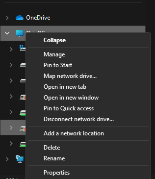
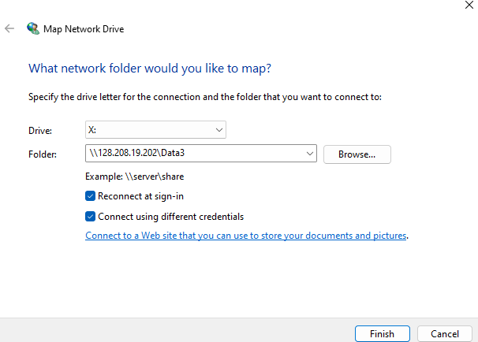
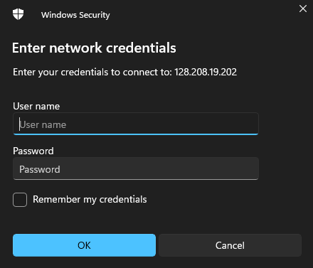

# BAIL Lab: Network Drive Instructions

Welcome to the guide for accessing and using remote network drives (NAS, Data2, and Data3) in the BAIL Lab.

### Table of Contents
*   **[Network Drive Connection Guide](index.html)**
*   **[Lab Printer Setup Guide](printer-setup.html)**

> **Important Prerequisite: Get Your Login Details**
> Before you begin, you must have a username and password. Please contact Thanu (`thanu56@uw.edu`) to have your account set up.

---

## Step-by-Step Connection Guide (Windows)

Follow these instructions carefully to map a network drive to your computer. You will need to repeat this process for each of the three drives you wish to access.

1.  Open **File Explorer**. In the left-hand navigation pane, right-click on **"This PC"**.
2.  From the context menu, select **"Map network drive..."**.

    

3.  In the dialog box that appears, choose an available **Drive** letter from the dropdown menu (e.g., `X:`, `Y:`, or `Z:`).

4.  In the **Folder** text box, enter the address for the drive you want to connect to. **Copy and paste one of the following addresses exactly:**

    *   For the **NAS** drive:
        ```
        \\nas.bail.bioeng.washington.edu\NAS
        ```
    *   For the **Data2** drive:
        ```
        \\128.208.19.161\Data2
        ```
    *   For the **Data3** drive:
        ```
        \\128.208.19.202\Data3
        ```

5.  Make Sure to check the box labeled **"Connect using different credentials"**.

    Your completed dialog should look similar to this (example using Data3):

    

6.  Click **"Finish"**.

7.  A new window will pop up asking for your network credentials. Enter the username and password provided (Request username and password if you haven't been assigned one yet).

    

8.  Access to the drive should now be granted! The new drive will appear under "This PC" in your File Explorer.

> **To access all three drives, simply repeat steps 1-7 for each of the remaining drive addresses**

## Troubleshooting

If you encounter any issues connecting:
*   **Restart your PC:** This is the most common fix. Try restarting your computer and then attempt the connection again.
*   **Double-check the address:** Ensure you copied the server address and path exactly as shown above.
*   **Verify credentials:** Make sure there are no typos in your username or password.
*   **Persistent issues:** If problems continue, please reach out for assistance!
