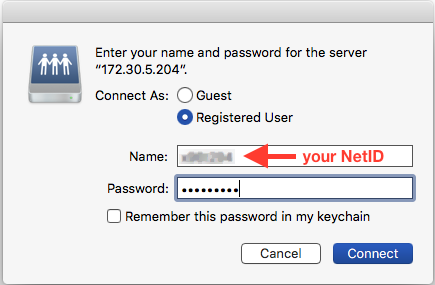
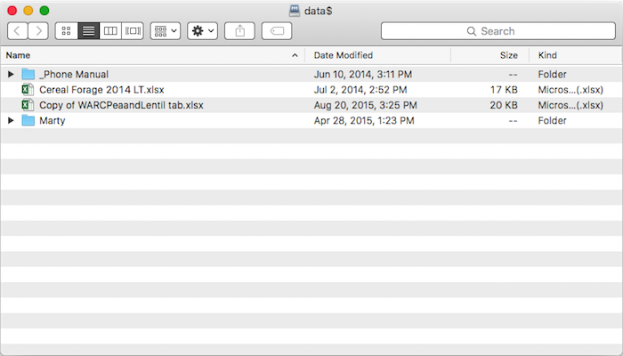

# BAIL Lab: Network Drive Instructions (macOS)

Welcome to the guide for accessing and using remote network drives (NAS, Data2, and Data3) on a Mac.

> **Important Prerequisite: Get Your Login Details**
> Before you begin, you must have a username and password. Please contact Thanu (`thanu56@uw.edu`) to have your account set up.

---

## Step-by-Step Connection Guide (macOS)

1.  Open the **"Connect to Server"** dialog box. The easiest way is to click on your desktop to ensure **Finder** is the active application, then press the keyboard shortcut: **`Command`** + **`K`**.
    *   Alternatively, you can click **"Go"** from the top menu bar, then select **"Connect to Server..."**.

    

2.  In the **Server Address** field, you need to tell your Mac which drive to connect to. **Copy and paste one of the following addresses exactly:**

    *   For the **NAS** drive:
        ```
        smb://nas.bail.bioeng.washington.edu/NAS
        ```
    *   For the **Data2** drive:
        ```
        smb://128.208.19.161/Data2
        ```
    *   For the **Data3** drive:
        ```
        smb://128.208.19.202/Data3
        ```

3.  (Optional but recommended) Click the **`+`** button to add this address to your "Favorite Servers" list for quick access in the future.

    

4.  Click **"Connect"**.

5.  You will be prompted to enter your credentials. Enter the username and password provided by Thanu.

    

6.  Click **"Connect"** again.

7.  Success! The network drive will now appear in the Finder sidebar under "Locations" and/or on your Desktop, depending on your Finder settings.

    

> **Tip:** To access all three drives, simply repeat steps 1-6 for each of the remaining server addresses.

## Troubleshooting

*   **Connection Fails?** Ensure you are connected to the university Wi-Fi or wired network. These servers are not accessible from off-campus networks.
*   **Authentication Error?** Double-check for typos in your username or password. Remember that passwords are case-sensitive.
*   **Restart your Mac:** If you're still having issues, a simple restart can often resolve network glitches.
*   **Persistent issues:** If problems continue, please reach out for assistance!
